## 报装设计文档 

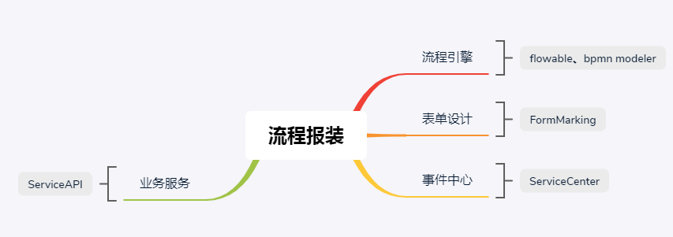

[TOC]

## 1、流程管理

### 1.1、模型管理

#### 1.1.1、模型管理列表

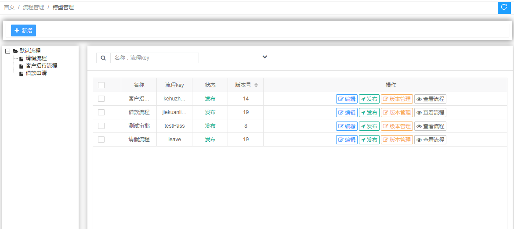

左侧以树状图的形式展示大类分为工程类和审批类，右侧展示模型列表

搜索条件：流程名称、code;

列表字段：流程名称、code、状态、版本号

操作区域：

- 编辑：设计流程图、配置节点表单、事件、人员权限等
- 发布：模型状态无效/有效
- 版本管理：一个模型可以有多个版本（只有一个主版本）

> 优点：开发运维过程中可能会对流程图反复设计，有了版本管理流程图就不会担心丢了，如果新设计的流程图有问题可以很快回滚到上个版本，且以后如果产品成熟公司可以有个模型库，比如版本管理->苏州、杭州、长沙等等各个地市分支在现场实施的时候可以直接选取使用或者在给客户调研需求时直接展示。

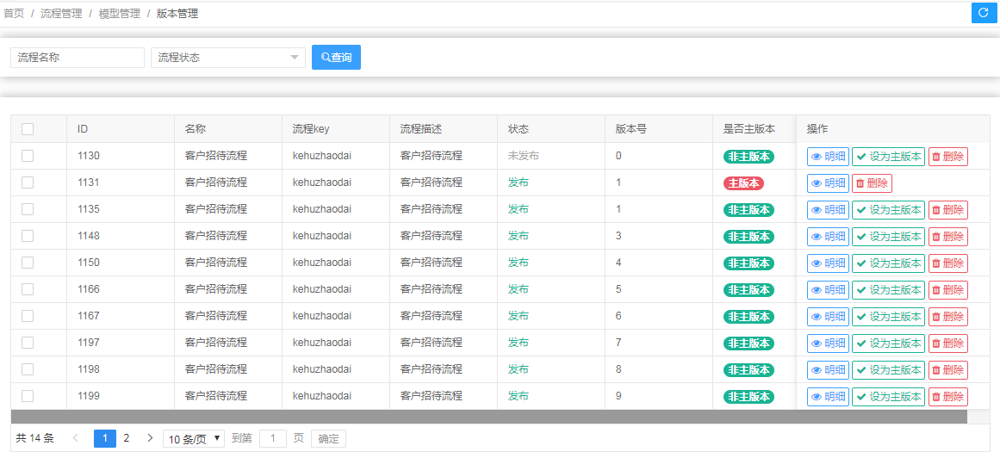

- 查看流程：点击展示流程缩略图

#### 1.1.2、模型设计

设计器分为如下几个大块：

- 工具栏
- 面板栏
- 流程画布
- 属性面板

##### 1.1.2.1、工具栏说明

工具栏主要是为了方便业务建模师进行一系列的快速操作，主要包含了模型的保存，校验，发布，导入，一键模拟运行等功能。详细功能如下图所示：

##### 1.1.2.2、工具栏按钮图标说明：

- 保存:可以使用该功能保存流程模型
- 导入:可以将已经存在的模型进行导入编辑操作。
- 校验：点击之后可以进行模型的正确性，并图形化方式对当前的模型存在的问题、警告、错误等信息进行展示。
- 复制：首先点击需要复制的节点，然后点击"复制”按钮，即可完成节点的复制。
- 删除：删除主要用于删除已经存在的BPM节点，首先选中需要删除的节点，然后点击"删除”按钮，即可完成节点的删除。
- 撤销:主要用于误操作的补救，比如绘制了一个名称为A的节点，如果不打算这个节点了，可以点击“撤销”按钮或者删除按钮即可完成。
- 撤回：与撤销功能类似。
- 布局类型功能：当一个模型元素比较多的时候，可能会被设计的杂乱无章，用户体验不好，这个时候就可以对多个元素进行布局排版，目前支持左对齐，右对齐，居中对齐，垂直对齐、水平对齐五种。
- 放大缩小功能：当流程设计器内容比较多的时候，可能无法快速定位想要需改的元素，这个时候就可以对画布进行放大或者缩小操作，这样可以非常方便的定位到期望修改的元素，然后点击真实大小，即可进行操作。
- 一键运行：当模型绘制完毕之后，如果对于模型的正确性有疑问，可以通过上文提到的模型校验或者一键运行进行测试，一键运行无需要进行模型的保存操作，即可快速的在模拟环境中，进行实例的启动操作，最终新显示，模拟实例所经过的路径。

> **优点：模型校验功能**

模型校验效果如下图所示：

模型校验按钮点击之后，画布会显示并罗列所有出问题的节点。红色的代表有错误信息，黄色的代表有警告信息，⚠️信息不等价于❌信息。

> **一键运行功能**

一键运行功能效果如下图所示：

点击一键运行按钮之后，该弹出框会完整的显示实例执行的信息，如果最后一条日志为结束节点，则表示该模型没有问题，可以正常启动和结束；否则代表该实例会卡在某个节点处。比如网关或者活动节点处的出线不满足条件时，会出线这种情况。盘古对应的表会记录模拟实例的详细信息，包括异常信息和运转信息。

> 关于模型校验与一键模拟运行的区别：
>
> 1. 模型校验为纯前段技术，一键模拟为后台技术。
> 2. 模型校验可以图形化方式显示模型中元素的错误或者警告信息，需要人工去逐个排查。一键模拟可以很直观的看出来当前的模型实际运转轨迹。
> 3. 模型校验和一键模拟策略均可以按需定制。
> 4. 模型校验更侧重于BPM2.0标准以及业务校验，一键模拟更侧重于流程的执行结果。

##### 1.1.2.3、面板说明

   在BPMN2.0标准中定义了适合不同场景的元素，大概有100多种类型的元素，结合以往的项目经历实际上用到到也就十几种

- 开始节点
- 结束节点
- 用户任务

- 排他网关
- 泳道
- 展开子流程

所以不推荐直接使用flowable modeler UI提供的原生设计器（如下图），推荐使用bpmn.js的二次开发，github有很多。

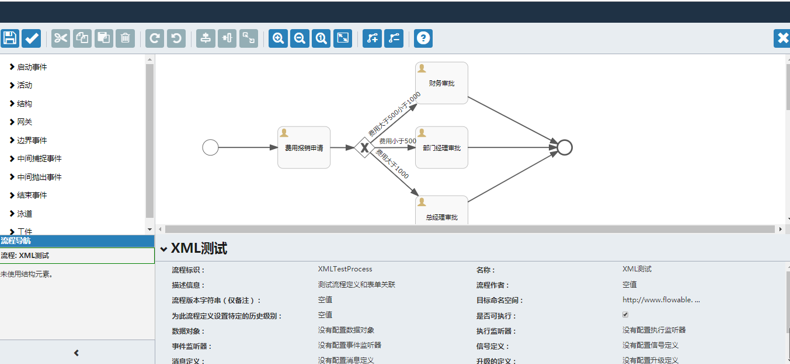

> **通用属性**

  不管是何种元素，均有如下的几个面板，如下图所示：

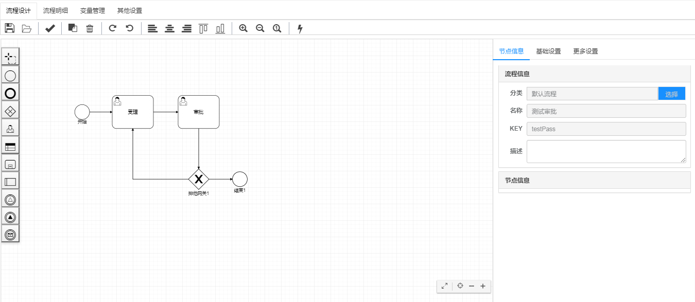

节点信息面板包含了如下两个子面板。包括流程信息和节点信息。

流程信息为全局的，该面板主要用来设置流程的分类、key、名称和描述信息。

###### 1.1.2.3.1、流程信息

  流程分类：用于将该模型聚合到指定的分类中，用户按照自己的业务进行归档即可。

  流程key：流程编码flowcode

  名称：模型的名称

  描述信息：用于描述该流程的用途，比如：“这是一个请假流程”。  

###### 1.1.2.3.2、节点信息

节点信息主要用来显示元素的id、名称、宽度、高度、X和Y信息。

  元素id：引擎自动生成，无需人工干预。 

  元素名称：默认为当前的元素类型中文名称+当前的索引号，比如“用户节点1”或者“用户节点2” ，依次类推。

  元素宽度、高度、X和Y信息：引擎自动生成，无需人工干预。

> **节点信息查看**

  节点信息在查看的时候，需要首先点击元素，然后才可以查看，如果没有选中元素，则不可以查看。具体操作如下图所示：

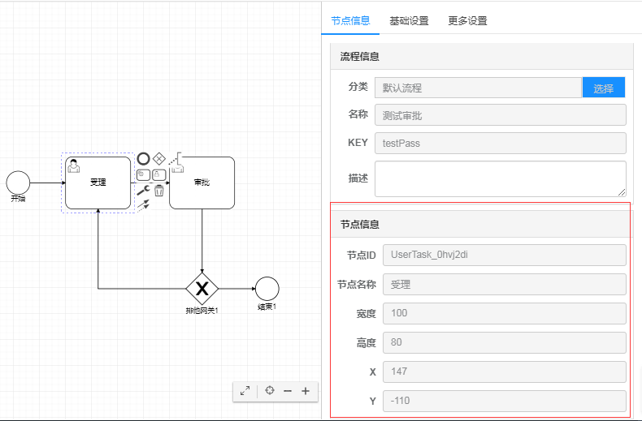

> 一定要先选中元素，才可以显示节点信息。

> **节点名称修改**

   首先双击元素，然后在编辑框中输入名字，点击回车或者光标离开钙元素即可，如下所示：

再次查看节点属性，即可发现名称进行了修改。

###### 1.1.2.3.3、基础设置

当节点为用户任务时：

~~全局设置：全局事件~~

###### 1.1.2.3.4、节点人员配置

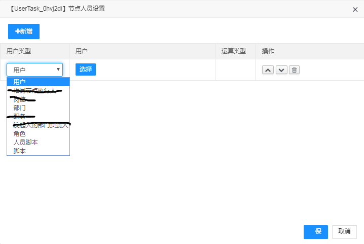

以几个维度供操作人员选择：指定用户、角色、部门除此之外优点还可以通过自定义的脚本去设置权限，比如说通过户号获取对应的抄表员进行审批。

###### 1.1.2.3.5、节点表单配置

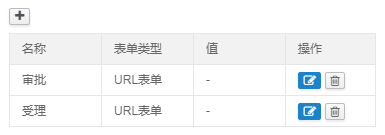

点击加号选择表单（参考老系统）

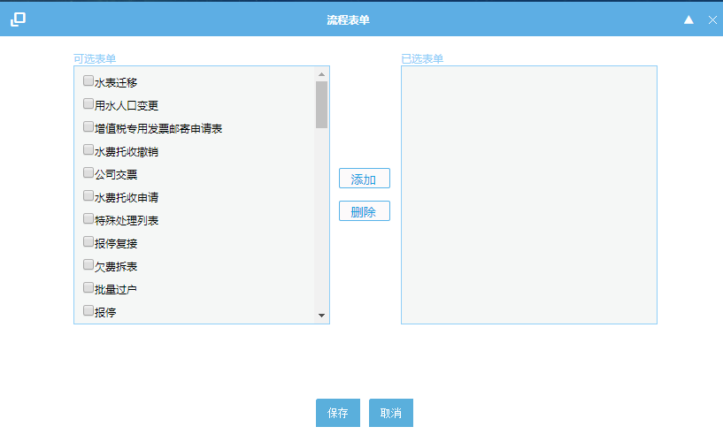

点击保存后进入上层页面，点击编辑按钮，根据表单展示出该表单下的字段以列表的形式展示，可以对字段进行属性的变更比如非空、只读、隐藏等。（如下图一：字段列表、下图二字段属性操作）

> 共同点：这里参考老系统继续沿用节点-字段（如下图）的思路，但是中间通过表单来传递，也就是说配置一个节点的表单时必须以表单为基础，选中某个表单后才会展示出表单的所有字段然后对每个字段进行非空、只读、隐藏的操作。

>不同点：老系统信息录入页面是通过添加字段组成的表单，新系统采用表单来对字段进行模块化，引入“主表单”概念，一个节点可以有多个表单，但必须指定主表单；

>优点：模块化后比如业主信息表单几乎每个审批流程都会用到，主表单直接配置即可，大大缩短了一个个拖字段的时间，不易出错，而且字段统一不会出现流程A联系方式叫phone，流程B叫mobile，这样的好处不仅仅是实施人员方便，后台事件接口的也可以通用不用每个流程都会定义一个不同的“业主信息”实体bo。

###### 1.1.2.3.6、节点属性配置

审批期限：工作日/自然日

驳回&退回策略：

> 优点：老报装没有此功能，有项目出现过此类问题，退回没有标准是原路返回还是退回指定节点

###### 1.1.2.3.7、节点事件配置

选择参考老报装（如下图）

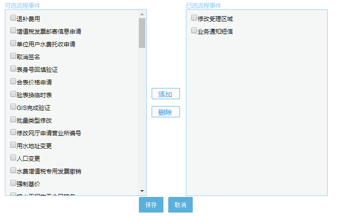

> 不同点:增加如下如所示的事件类型同步/异步和触发时机（属于去年报装优化点）

###### 1.1.2.3.8、节点按钮配置

可动态配置每个节点的按钮展示

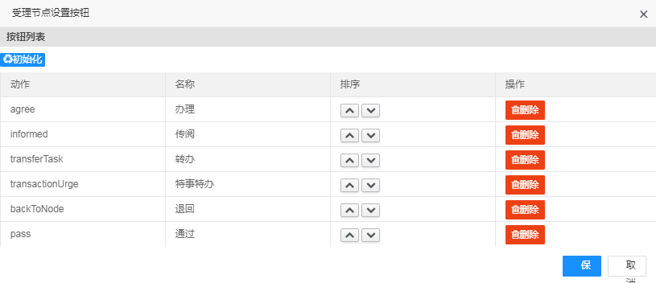

###### 1.1.2.3.9、分支条件配置

点击查看表达式获取JUEL表达式

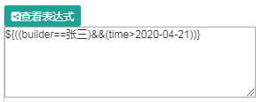

> 优点：在实际项目实施过程中流程流转出错大部分原因都是分支条件设置有误，比如中英文字母大小写、变量值拼错，使用这种方式可以从根本上杜绝这类问题的发生，且老报装系统中需要设置全局变量，实施过程中经常出现忘记配置全局变量就在分之条件中使用的情况，新系统去除全局变量的设置，flowable引擎将表单参数映射至流程变量，默认可选取表单中所有的字段（如下图）。

### 1.2、事件管理

#### 1.2.1、事件列表

> 事件列表展示事件编号、事件名称、事件url、事件类型

#### 1.2.3、新增事件

> 新增流程事件：

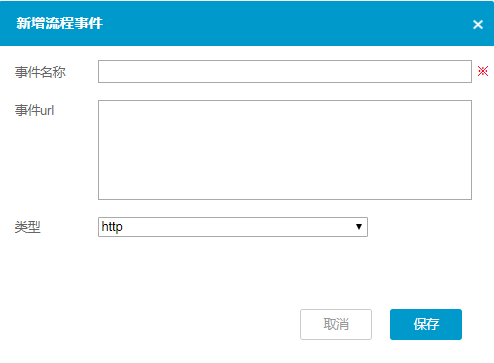

## 2、表单管理

业务表单建模采用可视化拖拽，大部分表单除了与业务表字段有关外其余的应该直接保存在流程引擎自带中间表里。因此建议表单建模分为三个模块

- 业务实体：业务实体的含义就是直接与数据库业务表对应的vo，它存在的意义是可以解耦与业务无关的表单字段及模块化整个表单的组成。业务实体可以直接在线输入字段提交自动建表，也可选择已存在的表进行字段选择。
- 业务对象：可以理解为是对多个业务实体的一个整合，业务对象的职责就是通过整合业务实体描绘出一个表单，当然在程序层面的表现就是对表单的数据结构进行设计。业务对象就是表单的数据结构（json）。
- 表单设计：新增一个表单要选择一个业务对象，选择完业务对象一个表单的主要业务数据结构就确定了，当然也可以可视化拖拽添加其他与业务无关的字段，也可以对业务字段进行位置排序移动。

### 2.1、业务实体

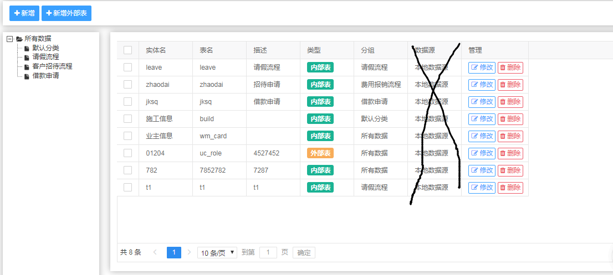

点击新增按钮进行新增页面

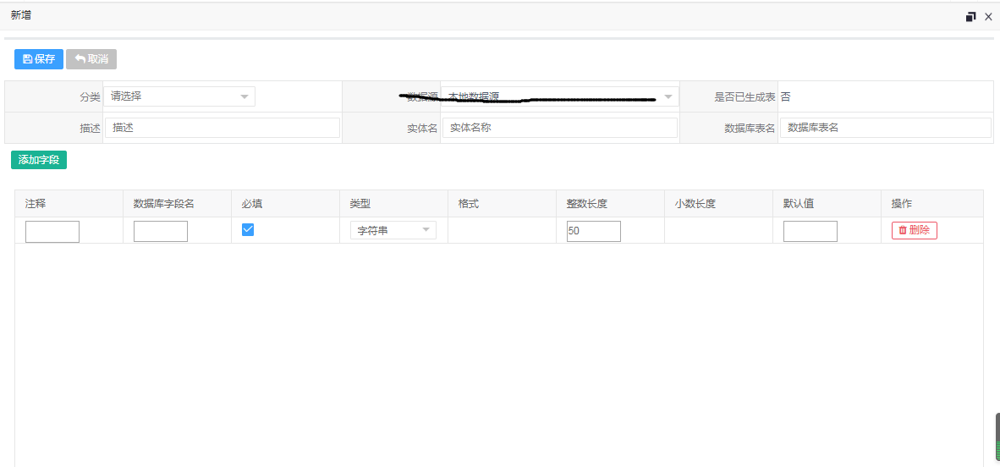

新增外部表本质是选择已经存在的表作为业务实体，外部表不能进行表结构变更。

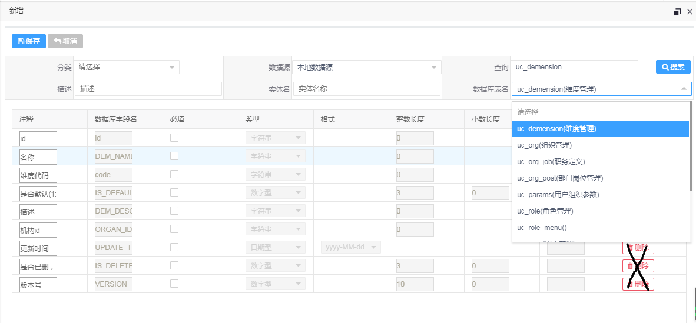

### 2.2、业务对象

业务对象是对业务实体的一个整合，一个业务对象是一个表单的主体结构图，一个表单可能会有多个子模块（子表单/业务对象）所以一个业务对象也就会有多个业务实体。

数据结构（红色标记标识子表单/业务实体）

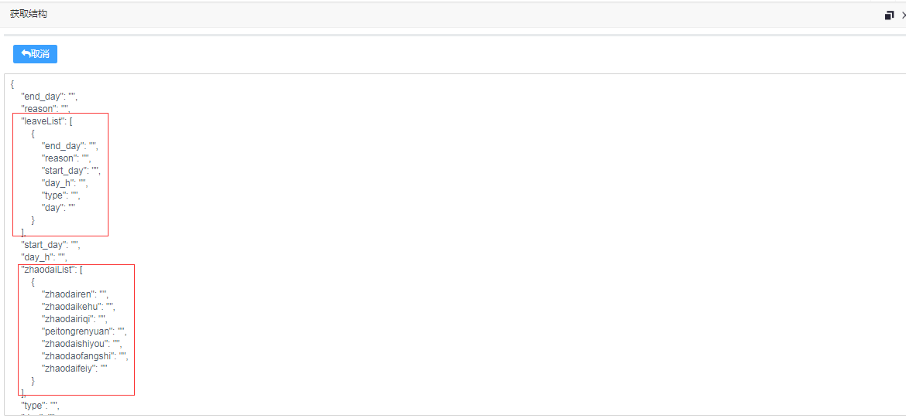

新增业务对象，业务对象一般都有个主业务对象，不是必填的，可以添加多个子业务实体，每个业务实体和主业务有一对一和一对多的关系。

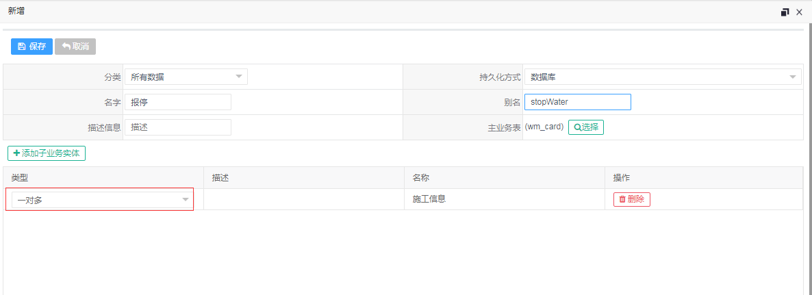

选择主业务表和添加子业务实体（即业务实体列表如下图）

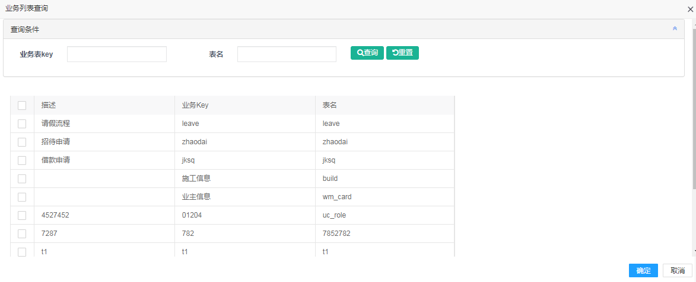

### 2.3、表单管理

上边说到一个表单对象一个业务对象，所以在新建表单的时候必须要选择一个业务对象作为它的主体结构。

点击下一步表单设计器插件会自动根据数据结构将一个表单的初始版本展示出来（如下图）

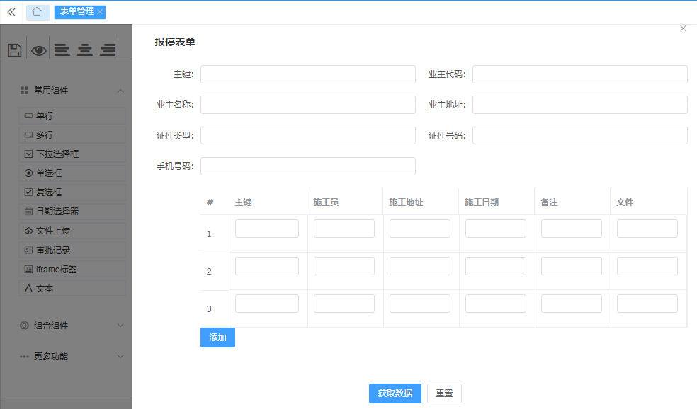

在这个基础上，可以拖动左侧的常用组件或者对现有的表单元素进行拖拽排序。

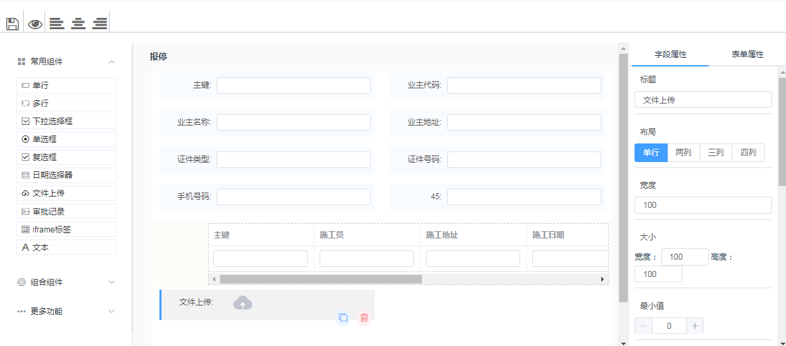